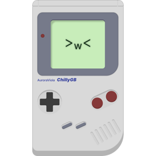

# ChillyGB

ChillyGB is an experimental Game Boy (DMG) emulator written in C that aims to simplicity and accuracy

## Planned features

* RTC support
* MBC2 mapper support
* Support for MBC0 mode selector
* Support for rom larger than 3MB
* Pixel FIFO and accurate PPU timings
* Sprite, Window and object palette selector
* Memory editor
* Accurate sound behaviours
* Link cable emulation for multiplayer support
* Web assembly port
* Frame blending
* Save states
* Screenshots
* Rom folder

## Not Planned features

* Gameboy color support
* Rewind
* SGB borders