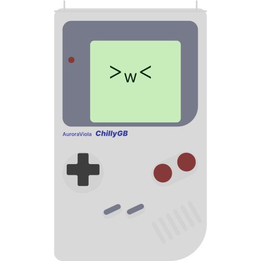

# ChillyGB

ChillyGB is an experimental Game Boy (DMG) emulator written in C that aims to simplicity and accuracy

You can try it now [here](https://chillygb.arci.me)

## Screenshots

## Planned features

* Emulation Improvements
  * MBC1 improvements
    * Support for ROM larger than 512KB
    * Support for RAM bank switching
  * RTC support
  * Support for rom larger than 4MB
  * Pixel FIFO and accurate PPU timing
  * VRAM and OAM Access
  * DMA Conflicts
  * Accurate sound behaviours
  * Link cable emulation and multiplayer support
  * Stop Instruction
* Graphical and particular features
  * Better menu
    * More options
  * Save states
  * Screenshots
  * Frame blending
  * Key editor
  * Sprite, Window and object palette editor
  * Rom folder
* Debugger Improvements
  * Stack viewer
  * VRAM viewer
  * Memory editor

## Not Planned features

* Gameboy color support
* ~~Boot Rom support~~
* Rewind
* SGB borders

## License

[GNU General Public License v3.0](https://github.com/AuroraViola/ChillyGB/blob/main/LICENSE.md)